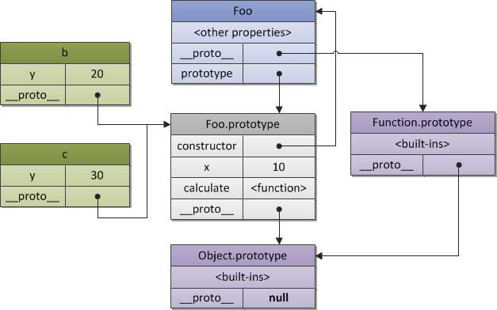

# JavaScript 探秘：构造函数 Constructor

> [原文](https://web.archive.org/web/20210304031619/http://www.nowamagic.net/librarys/veda/detail/1642)

除了创建对象，构造函数(constructor) 还做了另一件有用的事情—自动为创建的新对象设置了原型对象(prototype object) 。原型对象存放于 ConstructorFunction.prototype 属性中。

例如，我们重写之前例子，使用构造函数创建对象“b”和“c”，那么对象”a”则扮演了“Foo.prototype”这个角色：

```js
// 构造函数
function Foo(y) {
  // 构造函数将会以特定模式创建对象：被创建的对象都会有"y"属性
  this.y = y;
}

// "Foo.prototype"存放了新建对象的原型引用
// 所以我们可以将之用于定义继承和共享属性或方法
// 所以，和上例一样，我们有了如下代码：

// 继承属性"x"
Foo.prototype.x = 10;

// 继承方法"calculate"
Foo.prototype.calculate = function (z) {
  return this.x + this.y + z;
};

// 使用foo模式创建 "b" and "c"
var b = new Foo(20);
var c = new Foo(30);

// 调用继承的方法
b.calculate(30); // 60
c.calculate(40); // 80

// 让我们看看是否使用了预期的属性

console.log(

  b.__proto__ === Foo.prototype, // true
  c.__proto__ === Foo.prototype, // true

  // "Foo.prototype"自动创建了一个特殊的属性"constructor"
  // 指向a的构造函数本身
  // 实例"b"和"c"可以通过授权找到它并用以检测自己的构造函数

  b.constructor === Foo, // true
  c.constructor === Foo, // true
  Foo.prototype.constructor === Foo // true

  b.calculate === b.__proto__.calculate, // true
  b.__proto__.calculate === Foo.prototype.calculate // true

);
```

上述代码可表示为如下的关系：



上述图示可以看出，每一个 object 都有一个 `prototype`. 构造函数 Foo 也拥有自己的 `__proto__`, 也就是 `Function.prototype`, 而 `Function.prototype` 的 `__proto__` 指向了 `Object.prototype`. 重申一遍，`Foo.prototype` 只是一个显式的属性，也就是 b 和 c 的 `__proto__` 属性。

这个问题完整和详细的解释有两个部分：

- 面向对象编程.一般理论(OOP. The general theory)，描述了不同的面向对象的范式与风格(OOP paradigms and stylistics)，以及与 ECMAScript 的比较。
- 面向对象编程.ECMAScript 实现(OOP. ECMAScript implementation), 专门讲述了 ECMAScript 中的面向对象编程。

现在，我们已经了解了基本的 object 原理，那么我们接下去来看看 ECMAScript 里面的程序执行环境 [runtime program execution]. 这就是通常称为的“执行上下文堆栈” [execution context stack]。每一个元素都可以抽象的理解为 object。你也许发现了，没错，在 ECMAScript 中，几乎处处都能看到 object 的身影。
