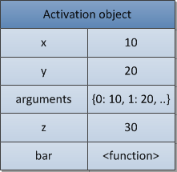

# 执行上下文其一：变量对象与活动对象

> [原文](https://web.archive.org/web/20210423082031/http://www.nowamagic.net/librarys/veda/detail/1644)

一个执行的上下文可以抽象的理解为 object。每一个执行的上下文都有一系列的属性（我们称为上下文状态），他们用来追踪关联代码的执行进度。这个图示就是一个 context 的结构。


除了这 3 个所需要的属性(变量对象(variable object)，this 指针(this value)，作用域链(scope chain) )，执行上下文根据具体实现还可以具有任意额外属性。接着，让我们仔细来看看这三个属性。

## 变量对象 (Variable Object)

> A variable object is a scope of data related with the execution context.
> It’s a special object associated with the context and which stores variables and function declarations are being defined within the context.
>
> 变量对象(variable object) 是与执行上下文相关的 数据作用域(scope of data) 。
> 它是与上下文关联的特殊对象，用于存储被定义在上下文中的 变量(variables) 和 函数声明(function declarations) 。

变量对象（Variable Object）是一个抽象的概念，不同的上下文中，它表示使用不同的 object。例如，在 global 全局上下文中，变量对象也是全局对象自身[global object]。（这就是我们可以通过全局对象的属性来指向全局变量）。

让我们看看下面例子中的全局执行上下文情况：

```js
var foo = 10

function bar() {} // // 函数声明
;(function baz() {}) // 函数表达式

console.log(
  this.foo == foo, // true
  window.bar == bar // true
)

console.log(baz) // 引用错误，baz没有被定义
```

全局上下文中的变量对象(VO)会有如下属性：


如上所示，函数“baz”如果作为函数表达式则不被不被包含于变量对象。这就是在函数外部尝试访问产生引用错误(ReferenceError) 的原因。请注意，ECMAScript 和其他语言相比(比如 C/C++)，仅有函数能够创建新的作用域。在函数内部定义的变量与内部函数，在外部非直接可见并且不污染全局对象。使用 eval 的时候，我们同样会使用一个新的(eval 创建)执行上下文。eval 会使用全局变量对象或调用者的变量对象(eval 的调用来源)。

那函数以及自身的变量对象又是怎样的呢?在一个函数上下文中，变量对象被表示为活动对象(activation object)。

## 活动对象 (activation object)

当函数被调用者激活，这个特殊的活动对象(activation object) 就被创建了。它包含普通参数(formal parameters) 与特殊参数(arguments)对象(具有索引属性的参数映射表)。活动对象在函数上下文中作为变量对象使用。

即：函数的变量对象保持不变，但除去存储变量与函数声明之外，还包含以及特殊对象 arguments 。考虑下面的情况：

```js
function foo(x, y) {
  var z = 30
  function bar() {} // 函数声明
  ;(function baz() {}) // 函数表达式
}

foo(10, 20)
```



同样道理，function expression 不在 AO 的行列。

我们接下去要讲到的是第三个主要对象。众所周知，在 ECMAScript 中，我们会用到内部函数 [inner functions]，在这些内部函数中，我们可能会引用它的父函数变量，或者全局的变量。我们把这些变量对象成为上下文作用域对象 [scope object of the context]. 类似于上面讨论的原型链 [prototype chain]，我们在这里称为作用域链 [scope chain]。
